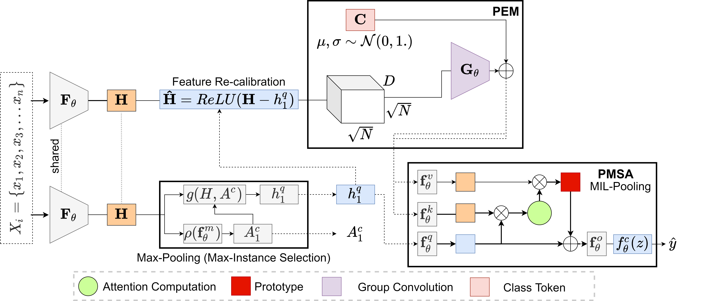

# FRMIL
### Official Pytorch Implementation of '[Feature Re-calibration based Multiple Instance Learning for Whole Slide Image Classification](https://conferences.miccai.org/2022/en/)' (MICCAI 2022)


> **Feature Re-calibration based Multiple Instance Learning for Whole Slide Image Classification**<br>
> Philip Chikontwe, Soo Jeong Nam, Heounjeong Go, Mee-jeong Kim, Hyun-Jung Sung, Sang Hyun Park 
>


> **Abstract:** *Whole slide image (WSI) classification is a fundamental task for the diagnosis and treatment of diseases; but, curation of accurate labels is time-consuming and limits the application of fully-supervised methods. To address this, multiple instance learning (MIL) is a popular method that poses classification as a weakly supervised learning task with slide-level labels only. While current MIL methods apply variants of the attention mechanism to re-weight instance features with stronger models, scant attention is paid to the properties of the data distribution. In this work, we propose to re-calibrate the distribution of a WSI bag (instances) by using the statistics of the max-instance (critical) feature. We assume that in binary MIL, positive bags have larger feature magnitudes than negatives, thus we can enforce the model to maximize the discrepancy between bags with a metric feature loss that models positive bags as out-of-distribution. To achieve this, unlike existing MIL methods that use single-batch training modes, we propose balanced-batch sampling to effectively use the feature loss i.e., (+/-) bags simultaneously. Further, we employ a position encoding module (PEM) to model spatial/morphological information, and perform pooling by multi-head self-attention (PSMA) with a Transformer encoder. Experimental results on existing benchmark datasets show our approach is effective and improves over state-of-the-art MIL methods.*


## Enviroment Requirements
* Ubuntu 20
* Python 3.7
* [CUDA 11.0](https://developer.nvidia.com/cuda-toolkit)
* [PyTorch 1.7.1](https://pytorch.org)

## Conda environment installation
```bash
conda env create --name FRMIL python=3.7
conda activate FRMIL
```
* run `pip install -r requirements.txt`

## Getting started

### Code Structure
```bash
FRMIL/
-- checkpoints/ : default model checkpoint save location (includes pre-trained weights).
-- common/ : common utilities and functions.
-- configs/ : configuration files for pre-processing.
-- datasets/ : split and library files for a given dataset.
-- models /: consists of network definitions
        - /dataloaders/: defines the data loaders
-- scripts/ : train/test scripts
-- wsi_tools/ : collection of pre-processing scripts.

train.py: the main training script that requires a config file
test.py : the main testing script ''.
plots_cm16.py : used to plot feature magnitudes w/ & w/o max-norm or using FRMIL.
```

### Datasets | Pre-computed Features
* Download pre-computed features for Camelyon16 [Link](https://zenodo.org/record/6682429#.YrQavVxBwYt)
  * Unzip the features and modify the DATA variable in scripts i.e., train/wsi_frmil.sh and test/wsi_frmil.sh to re-train from scratch. (see other options) \
  Run ```bash scripts/train/wsi_frmil.sh ```
  * Pre-trained weights are stored in checkpoints/cm16/ \
    Run ```bash scripts/test/wsi_frmil.sh ```

### Model Architecture 
  * See  `models/mil_ss.py`

### Datasets | Pre-process from Scratch
* Download entire Camelyon16 WSI [CM16](https://camelyon16.grand-challenge.org/) dataset 
* Pre-processing employs the 'wsi_tools' modules and configuration files(see. /config/cm16_tools.yml)
  * Modify the files in /datasets/wsi/cm16 with your actual data path for all classes (example files included.)
  * Modify paths for each step in 'cm16_tools.yml' i.e., global save location for extracted WSI tissue masks etc. (see. /config/cm16_tools.yml)
  * Run: \
    ``` python wsi_tools/xml2mask.py --config /path/to/config ``` \
    ``` python wsi_tools/sample_spot.py --config /path/to/config ``` \
    ``` python wsi_tools/sample_spot.py --config /path/to/config ``` \
    \
    Note: Repeat for each class type i.e., {normal, tumor}, also modify the save paths in the sample-spot configuration section. Sample_spot saves a library files for all patch locations for patch extraction (eg. tumor.pth, and normal.pth).

  * Once patch-locations have been sampled: Run: \
  ``` python wsi_tools/create_lib.py --config /path/to/config ``` : This combines the library files for each class into a single file. \
  ``` python wsi_tools/patch_gen.py --split 'train' ``` \
  ``` python wsi_tools/patch_gen.py --split 'train' ``` : Ensure the library root and patch save locations are modified in patch_gen.py. \

  * Create WSI features (instances-bags). Run : \
  ``` python wsi_tools/compute_features.py --config /path/to/config ``` : 
  
  * Modify the type of features (imagnet, simclr). 
  Employing SimCLR features requires training a model on the extracted patches. Use ```train_simclr.py``` and ```scripts/train/wsi_simclr.sh```.
  * Optionally, use the [DSMIL](https://github.com/binli123/dsmil-wsi) single-scale model trained SimCLR model to extract features i.e., download the weights (x20) and place them in ```/checkpoints/dsmil_models/model-v0.pth```: Use this model with option ``` dsmil_cm16 ``` in the compute features section of the configuration.
  * Train your new model, extracted bags will be placed in the desired save location following the format: \
  ```
    |---- CM16/
      ---- train/
        ---- 0/ XX_WSI_ID_1.pth, XX_WSI_ID_2.pth .... XX_WSI_ID_N.pth
        ---- 1/ XX_WSI_ID_1.pth, XX_WSI_ID_2.pth .... XX_WSI_ID_N.pth
      ---- test/
        ---- 0/ XX_WSI_ID_1.pth, XX_WSI_ID_2.pth .... XX_WSI_ID_N.pth
        ---- 1/ XX_WSI_ID_1.pth, XX_WSI_ID_2.pth .... XX_WSI_ID_N.pth
  ```

## Train | Test
Run ```bash scripts/train/wsi_frmil.sh ```

## Results
* The test results will be recorded in `./checkpoints/results_cm16.txt`

## References
Our implementation builds upon several existing publicly available code.

* [Weakly Supervised Temporal Action Loc](https://github.com/Pilhyeon/WTAL-Uncertainty-Modeling)
* [SetTransformer-ICML'19](https://github.com/juho-lee/set_transformer)
* [DSMIL](https://github.com/binli123/dsmil-wsi) 
* [TransMIL](https://github.com/szc19990412/TransMIL)
* [RENET-ICCV'21](https://github.com/dahyun-kang/renet/tree/main/datasets)

## Citation
If you find this code useful, please consdier citing our paper.

~~~~
@misc{https://doi.org/10.48550/arxiv.2206.10878,
  doi = {10.48550/ARXIV.2206.10878},
  url = {https://arxiv.org/abs/2206.10878},
  author = {Chikontwe, Philip and Nam, Soo Jeong and Go, Heounjeong and Kim, Meejeong and Sung, Hyun Jung and Park, Sang Hyun},
  title = {Feature Re-calibration based MIL for Whole Slide Image Classification},
  publisher = {arXiv},
  year = {2022},
}
~~~~